# Assignment 3 — Production Maintenance Drill (OPS Checklist)

Part of the DevOps Micro Internship (DMI) Cohort 3 with Agentic AI

---

## Purpose

In this assignment, you will treat your already deployed React application (on Ubuntu VM with Nginx) as a live production system. You will perform structured operational checks covering network validation, service health, log analysis, resource monitoring, configuration verification, and incident simulation with recovery — mirroring real on-call DevOps responsibilities.

---

# Task 1 — Server Access & Networking Validation

## Goal

Verify that the deployed React application is reachable from the browser and confirm basic network connectivity of the Ubuntu VM.

### Evidence

#### Screenshot 1 — Browser showing the React app with your Full Name visible on the UI

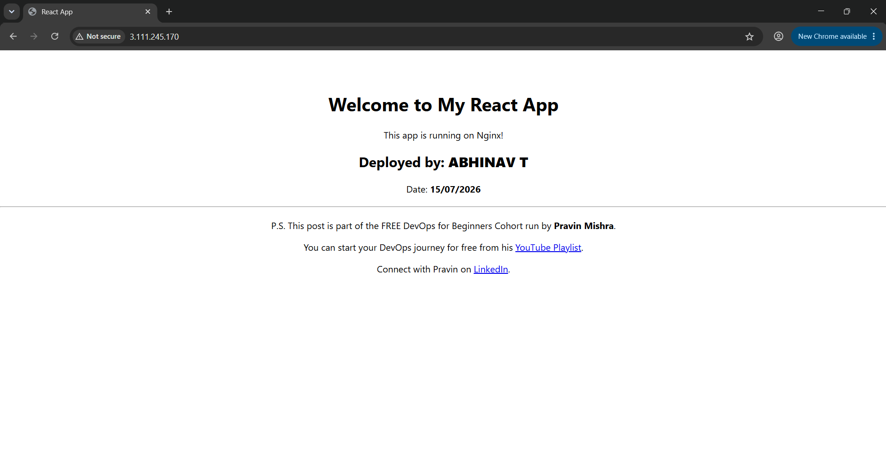

---

#### Screenshot 2 — Output of `ip a`

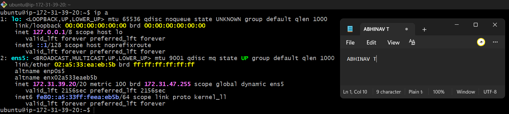

---

#### Screenshot 3 — Output of `sudo ss -tulpen`

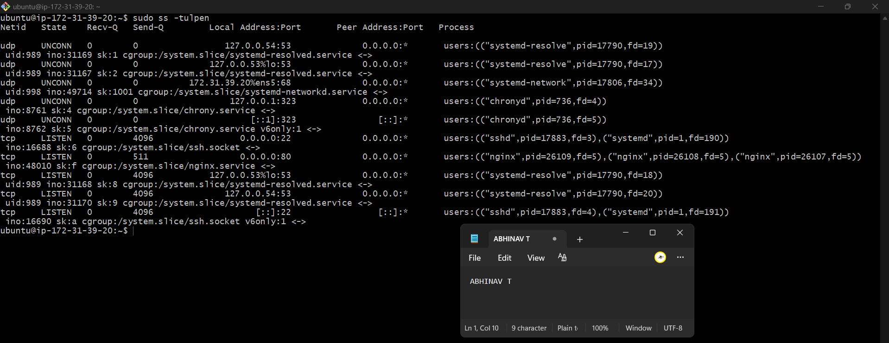

---

#### Screenshot 4 — Output of `sudo ufw status`

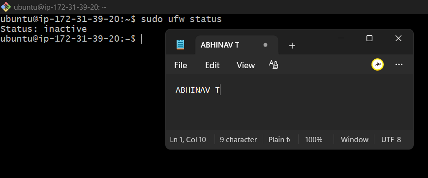

---

### Notes

Answer the following in your own words:

**1. What proves Nginx is listening on 0.0.0.0:80?**

ran the ss command and it showed Nginx on port 80. So I know Nginx is running.

---

**2. What proves SSH is active on port 22?**

The ss command showed SSH on port 22. That means SSH is working.

---

**3. Did you find any unexpected open ports? Explain briefly.**

No. I only saw 22 (SSH) and 80 (HTTP) open, which are the expected ports for managing the server and serving the website.

---

# Task 2 — Service Health & Systemd Validation (Nginx)

## Goal

Verify that Nginx is properly installed, running, enabled at boot, and safely configured.

### Evidence

#### Screenshot 1 — Output of `systemctl status nginx --no-pager`

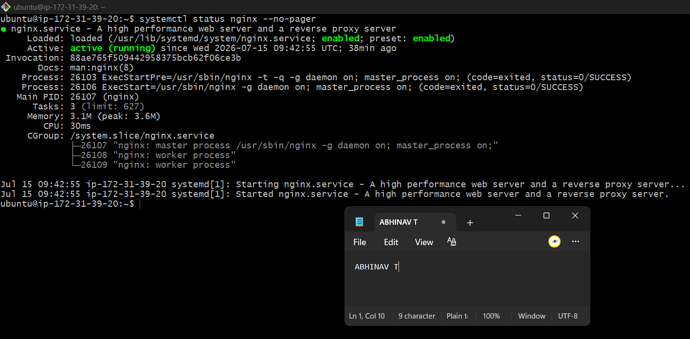

---

#### Screenshot 2 — Output of `sudo nginx -t`

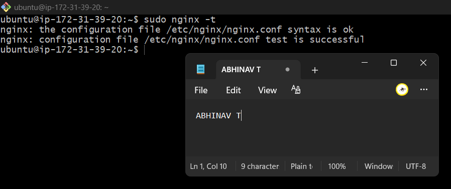

---

#### Screenshot 3 — Output of `sudo ss -lptn '( sport = :80 )'`

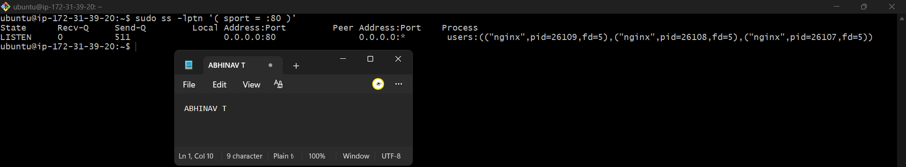

---

### Notes

Answer the following in your own words:

**1. What happens if Nginx fails to restart in production?**

If Nginx does not restart, the website will go down and users will not be able to open it.

---

**2. What's your basic rollback plan?**

I will restore the last working Nginx configuration, check it with nginx -t, and then restart Nginx again.

---

# Task 3 — Logs & Request Trace

## Goal

Verify real traffic flow and analyze logs to understand system behavior and errors.

### Evidence

#### Screenshot 1 — Output of `sudo tail -n 30 /var/log/nginx/access.log`

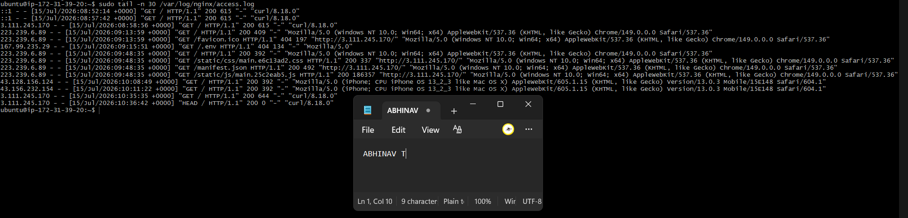

---

#### Screenshot 2 — Output of `sudo tail -n 30 /var/log/nginx/error.log`

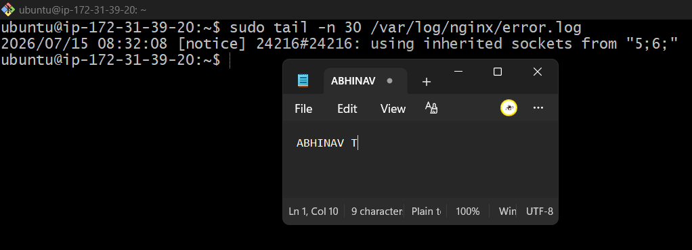

---

#### Screenshot 3 — Output of `sudo journalctl -u nginx --no-pager -n 50`

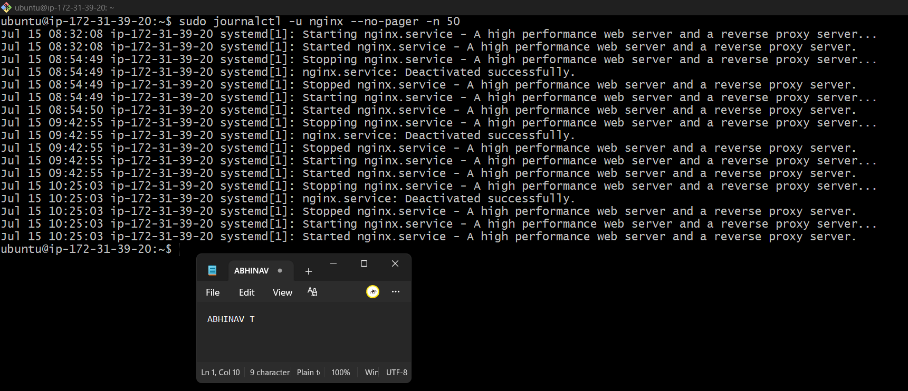

---

### Notes

Answer the following in your own words:

**1. Were there any errors in the logs?**

- If yes, mention 1–2 example error lines from the logs and explain what each one means in simple terms.
- If no, explain what it means if the error log is empty or shows no recent errors during your check.

No. I did not find any errors in the logs. The error log and systemd journal did not show any recent errors during my check.

---

**2. If there were no errors, what does that indicate about the system?**

It means the Nginx service was running properly and there were no recent problems with the server.

---

**3. Based on the access logs, were your curl requests visible in the log entries? What does that prove about traffic flow?**

Yes. My curl requests were visible in the access log. This proves that the requests reached the server and Nginx handled them successfully.

---

# Task 4 — System Resource Health Check (Capacity Red Flags)

## Goal

Assess server capacity and detect potential performance or failure risks.

### Evidence

#### Screenshot 1 — Output of `uptime`

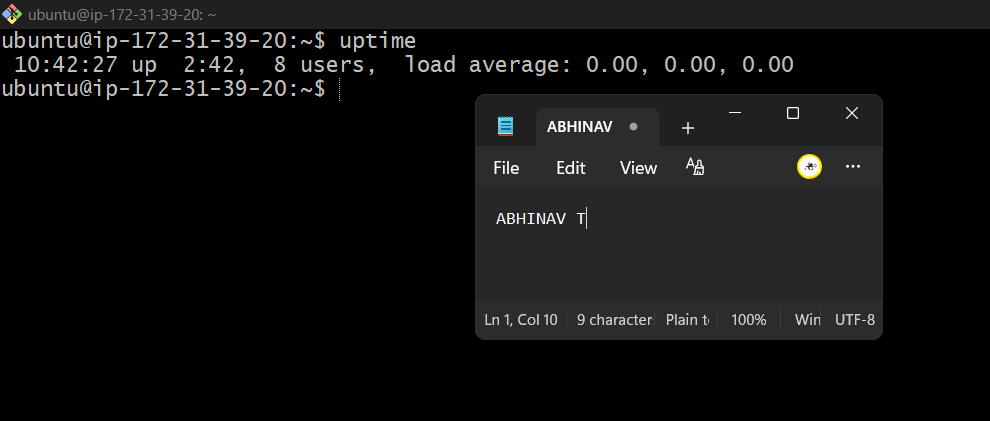

---

#### Screenshot 2 — Output of `free -h`

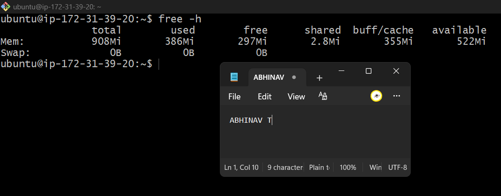

---

#### Screenshot 3 — Output of `df -h`

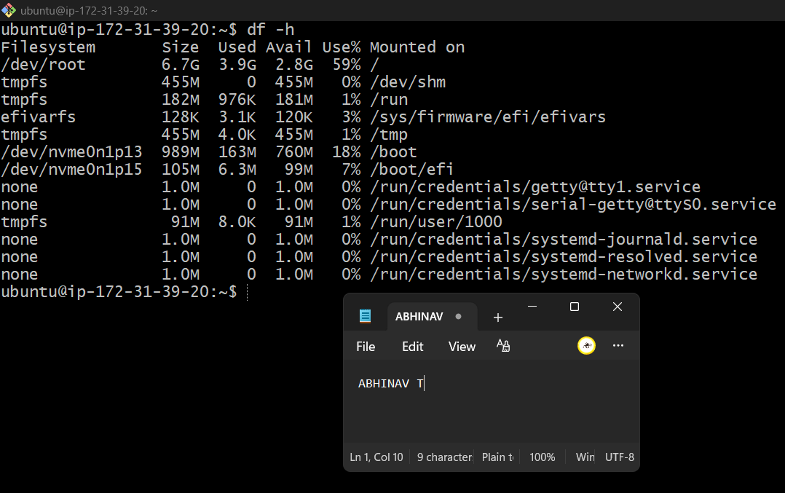

---

#### Screenshot 4 — Output of `sudo du -sh /var/* | sort -h`

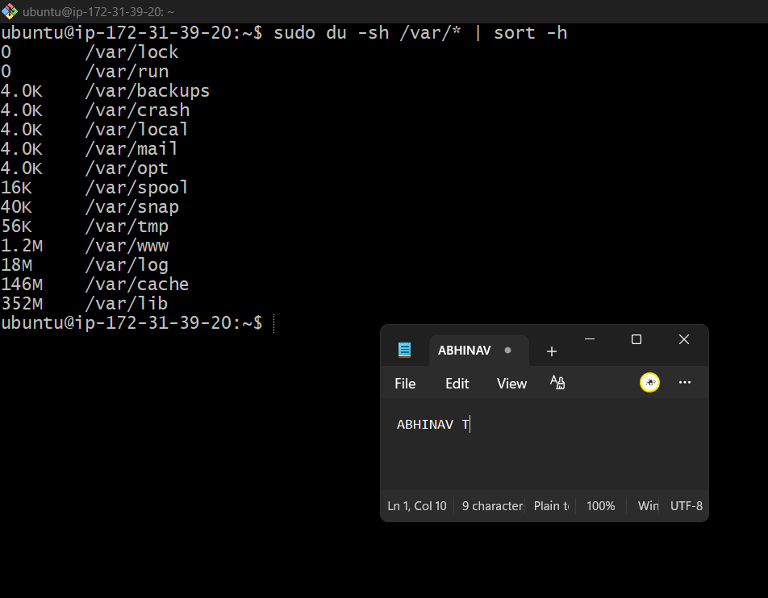

---

### Notes

Answer the following in your own words:

**1. Which resource looks most critical right now? (CPU/load, memory, or disk) Explain why.**

The disk is the most important to watch. It is using 59% space. It is fine now, but if it gets full, it can cause problems.

---

**2. What happens if disk becomes 100% full in a production server?**

If the disk becomes full, the website or services may stop working properly because the server cannot save new files or logs.

---

# Task 5 — Configuration & Deployment Verification

## Goal

Ensure the correct React build is deployed and Nginx is serving it properly.

### Evidence

#### Screenshot 1 — Output of `ls -lah /var/www/html | head -n 20`

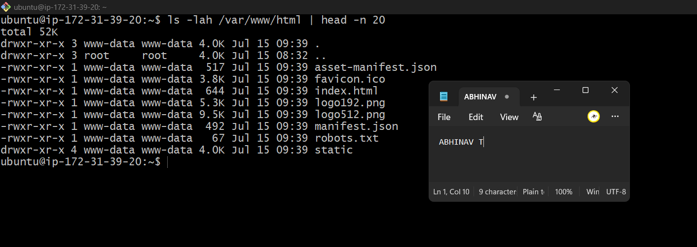

---

#### Screenshot 2 — Output of `grep -R "Deployed by" -n /var/www/html 2>/dev/null | head`

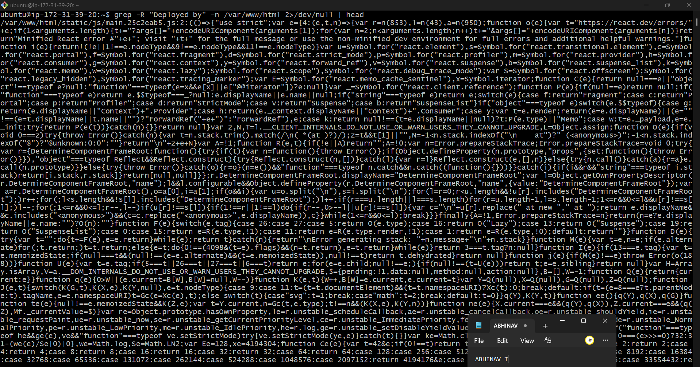

---

#### Screenshot 3 — Output of `grep -n "try_files" /etc/nginx/sites-available/default`

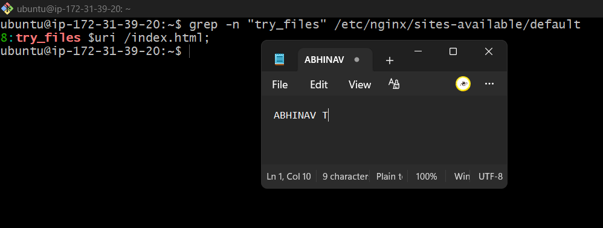
---

### Notes

Answer the following in your own words:

**1. How do you confirm that the correct version of the application is deployed?**

The UI displays my full name and the latest date, which matches the latest build files.

---

# Task 6 — Nginx Configuration Failure Simulation

## Goal

Simulate a real-world Nginx misconfiguration and recover the service safely.

### Evidence

#### Screenshot 1 — Output of `sudo nginx -t` showing the syntax error (broken config)

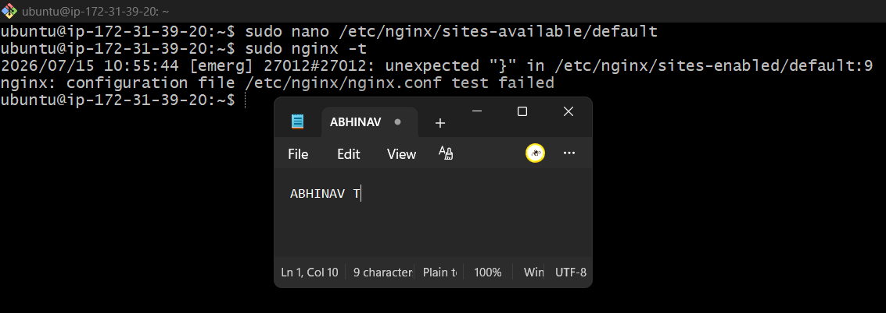

---

#### Screenshot 2 — Output of `sudo nginx -t` showing syntax ok (fixed config)

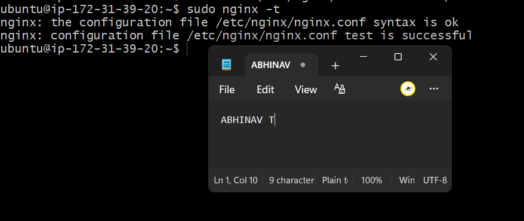

---

#### Screenshot 3 — Output of `curl -I http://<public-ip>` confirming recovery (200 OK)

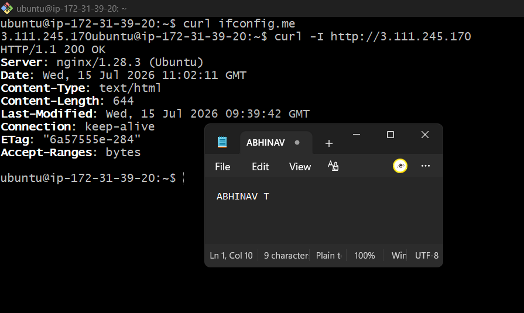

---

### Notes

Answer the following in your own words:

**1. What caused the configuration failure?**

Invalid nginx syntax.

---

**2. How did you fix the issue?**

Corrected config and validated before restart.

---

**3. How can you avoid this kind of issue in real production systems?**

Always run nginx -t before reloads.

---

# Task 7 — Web Application Failure Simulation

## Goal

Simulate missing deployment content and recover the application safely.

### Evidence

#### Screenshot 1 — Output of `curl -I http://<public-ip>` showing failure (non-200 response)

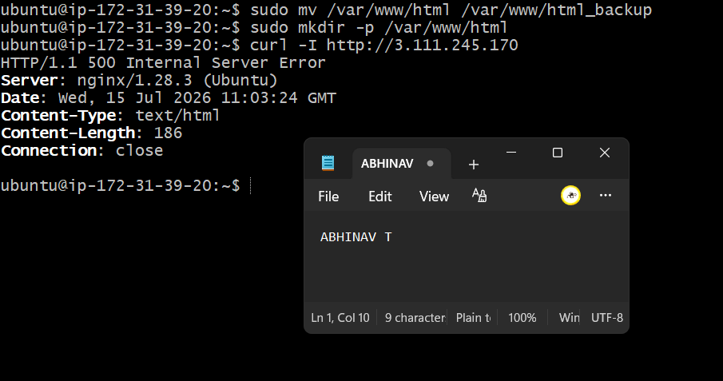

---

#### Screenshot 2 — Output of `curl -I http://<public-ip>` confirming recovery (200 OK)

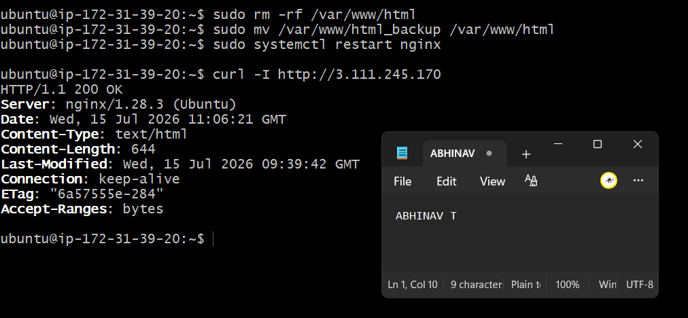

---

### Notes

Answer the following in your own words:

**1. What caused the application to break in this scenario?**

The app stopped working because I moved the website files from the /var/www/html folder. Nginx could not find the files, so it showed 500 Internal Server Error

---

**2. How did you fix the issue and restore the application?**

I moved the backup folder back to /var/www/html, restarted Nginx, and checked the website. It showed 200 OK, so the app was working again.

---

**3. What steps would you take to prevent this kind of issue in real production systems?**

I will take a backup before making changes, check everything after the changes, and keep a backup so I can restore it if something goes wrong.

---

# Task 8 — Security & Reliability Review

## Goal

Review and reflect on the security and reliability practices applied during this assignment.

### Security & Reliability Notes

Answer the following in your own words:

**1. Why is SSH key-based authentication more secure than sharing passwords?**

SSH keys are safer because they are harder to break than passwords.

---

**2. Why should only required ports be open on a production server?**

Only needed ports should be open so the server stays safe.

---

**3. Why is it important for Nginx to be enabled on boot?**

So Nginx starts by itself after a restart and the website keeps working.

---

**4. What are the risks of sharing secrets, keys, or credentials publicly?**

Someone else can use them and get access to the server.

---

**5. Why should cloud resources be stopped or terminated when they are no longer needed?**

It saves money because you don't pay for resources you are not using.

---

# LinkedIn Post (Required)

## Evidence

#### LinkedIn Post URL

https://www.linkedin.com/posts/abhinav-t-210682296_dmibypravinmishra-react-nginx-ugcPost-7483118745591300096-7wi8/?utm_source=share&utm_medium=member_desktop&rcm=ACoAAEelfqwBrAEfQ03WBMjV0-o9bvqgBIe7vGM

---

#### Screenshot — Published LinkedIn post

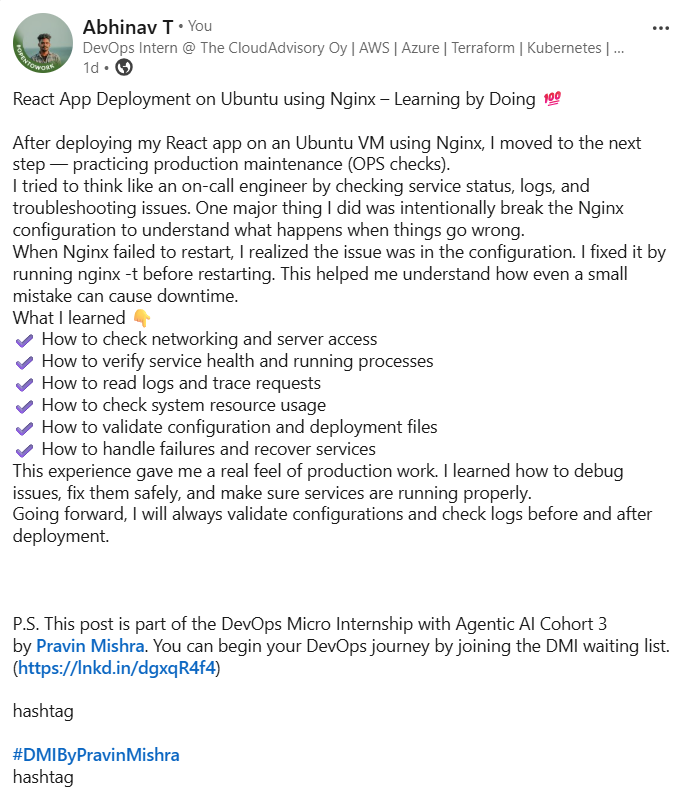
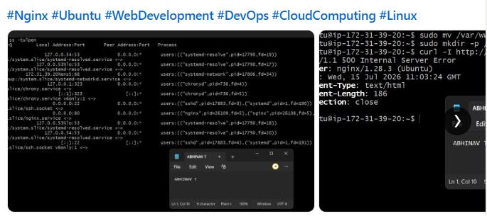

---

# Submission Instructions

- Add all required screenshots in your submission
- Full name must be visible in required screenshots
- Do not expose sensitive information (keys, passwords, account IDs)

---

# Completion Checklist

- [✅] Task 1: Screenshots (browser, ip a, ss -tulpen, ufw status) + Notes answered
- [✅] Task 2: Screenshots (nginx status, nginx -t, ss port 80) + Notes answered
- [✅] Task 3: Screenshots (access log, error log, journalctl) + Notes answered
- [✅] Task 4: Screenshots (uptime, free -h, df -h, du -sh) + Notes answered
- [✅] Task 5: Screenshots (ls html, grep deployed by, grep try_files) + Notes answered
- [✅] Task 6: Screenshots (nginx -t fail, nginx -t pass, curl recovery) + Notes answered
- [✅] Task 7: Screenshots (curl failure, curl recovery) + Notes answered
- [✅] Task 8: Security & Reliability Notes answered
- [✅] LinkedIn post published and URL submitted
- [✅] Full Name visible in all required screenshots
- [✅] No sensitive data exposed

---

## 📌 About DMI & CloudAdvisory

DevOps Micro Internship (DMI) is a project-based DevOps program run by Pravin Mishra (The CloudAdvisory) focused on real-world execution, systems thinking, and career readiness.

It helps learners build strong DevOps foundations with hands-on experience.

---

## 📌 Resources

- 🌐 DMI Official Website: https://pravinmishra.com/dmi  
- 🎓 DevOps for Beginners (Udemy): https://www.udemy.com/course/devops-for-beginners-docker-k8s-cloud-cicd-4-projects/  
- 🎓 Agentic AI DevOps with Claude Code: https://www.udemy.com/course/ultimate-agentic-ai-devops-with-claude-code/  
- 🎓 DevOps with Claude Code: Terraform, EKS, ArgoCD & Helm: https://www.udemy.com/course/devops-with-claude-code-terraform-eks-argocd-helm/  
- ▶️ YouTube Playlist: https://www.youtube.com/playlist?list=PLFeSNDtI4Cho  
- 🔗 Pravin Mishra (LinkedIn): https://www.linkedin.com/in/pravin-mishra-aws-trainer/  
- 🏢 CloudAdvisory (LinkedIn): https://www.linkedin.com/company/thecloudadvisory/

---

*This submission is part of DevOps Micro Internship (DMI) Cohort 3 — Agentic AI Track.*